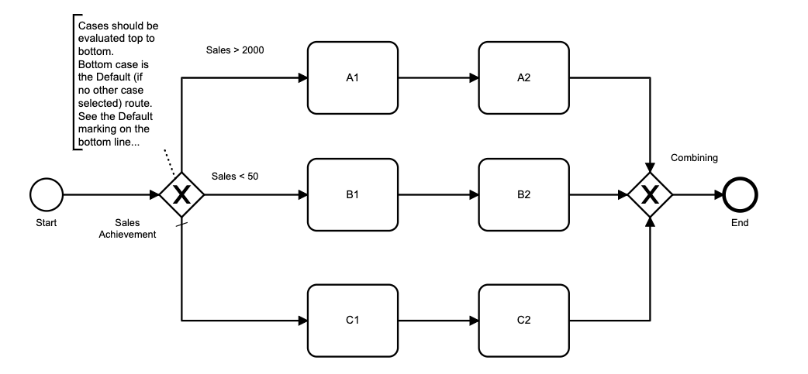
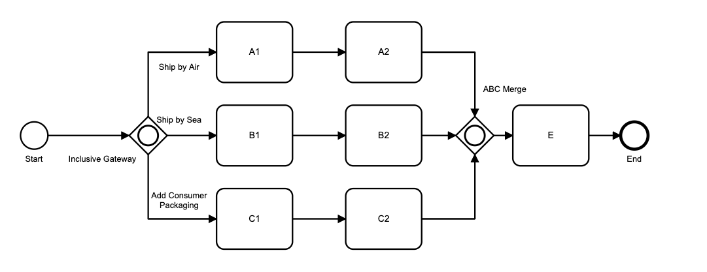

# Gateways and Parallel Flows

## General

In Flows for APEX, BPMN diagrams should use explicit Gateway objects to control process flow.  Flows for APEX supports the following BPMN Gateway objects:

## Exclusive Gateways (XOR)

With an Exclusive Gateway, a decision made by the process or by a user allows only one of the possible forward paths to proceed.

## Parallel Gateways (AND) 

At a Parallel Gateway, all forward paths proceed in parallel with their own subflow.  The incoming subflow is halted with status of 'split'.

Adding a second Parallel Gateway causes the parallel workflows to merge and re-synchronise.  In the diagram above, Path A, Path B and Path C all wait at the Merging Parallel Gateway until all three paths have completed, before a single path proceeds to task D.

A parallel workflow does not have to re-merge and re-synchronise.  You can have all of the forward paths proceed to their own process end events, so shown in this diagram.

Note, however, that merging and synchronisation has to occur either for all of the parallel flows, or for none of them.  Having 2 of the forward paths re-merge, but one continue to it's own end -- as shown in the diagram below - is not supported.

A parallel workflow that merges should usually be merged with an explicit merge / re-synchronise gateway.  The following scenario shows an implicit merger, without a closing Parallel Gateway.  If you created this workflow, note that all of the parallel paths will continue to execute Task D and then end.  So D would be executed 3 times.  While you might have a business process where this is the desired behaviour, this is likely to be unusual!

It's usually fairly easy to re-write process structure to create balanced gateway pairs, without impact on the actal business process.  The following example takes a nested pair of gateways that areunbalanced, and rewrites them as two balanced pairs of Parallel Gateways to achieve the same process workflow that can be handled by Flows for APEX.

A merging Parallel Gateway can also be used to merge, syncronise, and then re-split the flow -- as in thefollowing diagram.

Flows for APEX does not support a standalone parallel gateway as a merging event.  Merging can only be done for workflows that were earlier split by an equal Parallel Gateway.

## Inclusive Gateways (OR)

An Inclusive Gateway allows one or more of the possible forward paths to occur, in parallel.  In many ways, this can be thought of as a cross between the Exclusive Gateway and the Parallel Gateway functionality.  With an Inclusive Gateway, a decision made by the process or by a user allows one or more of the possible forward paths to proceed.

In this example, the business process of a manufacturer allows goods to be shipped by air, by sea, and to have additional consumer packaging added.  One, two, or all three of these options can be chosen.  Thec processes merge / re-synchronise at the matching closing Inclusive Gateway, labelled "ABC Merge", before proceeding to task E.

Like with Parallel Gateways, Inclusive Gateways must either:

- occur in a balanced pair, where all of the options start at one opening Inclusive Gateway and then all end at a matching closing / merging Inclusive Gateway, or
- start with an Inclusive Gateway, and then all of the optional parral paths proceed to their own end events.

At the merging / closing Inclusive Gateway, all routes that were started must complete at the gateway before the single forward path commences.  This re-sychronises the overall process before it continues.

If no closing gateway is incuded, all routes must proceed to their own end events, as in the diagram below.

An Inclusive Gateway cannot act, simultaneosly, as both a Merging / Closing gateway and an Opening Gateway.

