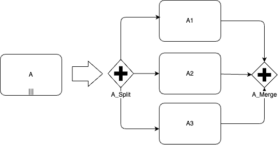

# BPMN Loops and Iterators

This feature allows certain bpmn objects (tasks, subProcesses, and Call Activities) to be executed multiple times for each member of a collection.  Execution of the multiple instances can occur sequentially or in parallel.

## Basic Concept of Operation

At the start of each step, `flow_engine.complete_step` tests to see if the new step contains a `standardLoopCharacteristics` or `multiInstanceLoopCharacteristics` tag.  If so, iteration processing is started.

Iteration processing has to perform the following functions before starting any iterations:
  - determine what type of iteration is required
		- Multi-instance parallel processing 
		- Multi-instance sequential processing
		- Loop processing (not sure if this will be in V1)
 - evaluate input data set that will be made available inside the iteration
 - define the output data to be returned

When each iteration is started:
- each iteration has a unique value of `loop counter` from 1 to n.
- create a new subflow for the iterated object.  New subflow will copy its parent subflow except for. the following items:

| Subflow Column | Value |  Notes |
| --- | ---| --- |
|  sbfl_id |  new sbfl_id. | set as identity next value |
| sbfl_loop_counter | bpmn loop counter 1…n | corresponds to input array data in row n-1  (array is 0…n-1 |
| sbfl_sbfl_id | Parent sbfl (the iterating object) | set to sbfl_id of the iterating task |
| sbfl_scope | = new sbfl_id | iterator operates in its own scope |
| sbfl_process_level | = new sbfl_id | operates in its own process level |
| sbfl_starting_object | = iterating object | | 

 ## Iteration Input and Output Data 
 
General Concept is that there should be a collection - an array of input data - each member of the collection creates the data for an iteration.  For loop counter = 1, data in array row 0 (0 based) is used to create the variables inside iteration 1 (1 based).  

Output data is specified as a list of variables.   Each iteration can add a value for each output variable.  When an iteration completes, the output variables for the iteration with `loop counter x` are added to the output array row (x-1). 

### Methods for Specifying Input Collection

1.  Array of Values in a VC2 Colon Delimited List (e.g., a list created by a SQL Multi function).  These could, for example, be an array of primary keys of rows to be processed.
2.  JSON array.  A JSON array that we use for the iterations.
3. Matrix of Multi-Values Specified by a SQL Query.  At Iteration Start, we would execute the query returning values into a JSON table.  The multi-iteration would execute once for each row in the JSON table.  Variables inside the iterations would be named based on the returned column names / aliases from the query.


| Method |  Expression type | expressionType | Expression (expression) | Other Parameters | Note |
| --- | --- | --- | --- | --- | ---|
| Static List | Static List (Colon separated List) | static |static content | Input Variable Name (inputVariable)| separator is ':' |
| Static Array | Static Array (JSON Array) | static |static content | static | |
| Process Variable | Process Variable (Colon separated List) | processVariable | variable name | Input Variable Name (inputVariable) | VC2 or CLOB |
| Process Variable | Process Variable (JSON Array) | processVariable| variable name | | VC2, CLOB or JSON |
| SQL Query | SQL Query | sqlQueryArray | SQL query text | | 1 or more columns |
| PL/SQL Expression |  Expression |plsqlRawExpression | PL/SQl Expression | | returning JSON table |
| PL/SQL Function Body  |  Function Body | plsqlRawFunctionBody| PL/SQL function | | returning JSON table |

Notes:

1.  JSON, SQL query, PL/SQL expression and function methods can return multiple columns.  each column returned wiill use the column name to create a process variable name in the iteration instance.  
2.  Static List and process variables containing a colon delimited list will contain just 1 input value per iteration instance.   The process variable inside the iteration is specified in the third parameter, `Input Parameter Name`.
3.  Variables will be created using the type of the query result or JSON item.  Colon delimited varchar2 methods will create varchar2 process variables.
4.  JSON tables are indexed starting at 0.   BPMN Loop Counter values start from 1.  So items for Loop Counter `n` are in the JSON row `n-1`.


### Control Variables

BPMN specifies several variables for use in controlling the execution of a Multi-Instance Iteration.  These are available in the parent scope - i.e, the scope of the object that is being iterated. 

| Variable | Use |
| --- |  --- |
| LoopCounter | Each iteration has a unique loop counter, from 1 to nrOfInstances |
| nrOfInstances | The total number of instances to execute |
| nrOfActiveInstances | The number of Instances that are currently active |
| nrOfCompletedInstances | The number of Instances that have Completed |
| nrOfTerminatedInstances | The number of Instances that have Terminated |

These control variables should be available for use by the `Completion Condition`.

### Completion Condition

A Multi-Instance or Loop Step should be able to specify a Completion Condition.  The Completion Condition can be expressed as a PL/SQL Expression or Function Body returning a Boolean.  

The Completion Condition is evaluated at the end of each iteration instance execution.  If the Completion Condition evaluates to  `true`, any other iteration instances will be terminated, and the iteration parent will do a `step completed` operation.

Syntax for this should be similar / equivalent to the `bpmn:conditionExpression` that we use for gateway routing expressions.  Note the keyword is `bpmn:completionCondition` in this case.  Syntax would be:

```xml
<bpmn:completionCondition 
	xsi:type=“bpmn:tFormalExpression”
	language=“plsqlExpression|plsqlFunctionBody”>expression
</bpmn:completionCondition> 
```
  

## BPMN Syntax

### Loop Syntax

``` xml
    <bpmn:task id="Activity_1afniku" name="A (Loop)">
      <bpmn:extensionElements />
      <bpmn:incoming>Flow_195b17p</bpmn:incoming>
      <bpmn:outgoing>Flow_1cfut2s</bpmn:outgoing>
      <bpmn:standardLoopCharacteristics />
    </bpmn:task>
```

### Parallel Iteration Syntax

```xml
    <bpmn:task id="Activity_1jhj7dl" name="B (Par)">
       <bpmn:incoming>Flow_1cfut2s</bpmn:incoming>
       <bpmn:outgoing>Flow_0r4hhoj</bpmn:outgoing>
       <bpmn:multiInstanceLoopCharacteristics>
          <bpmn:extensionElements>
               <apex:inputCollection>
                   <expressionType>"expression_type"</expressionType>
                   <expression>"expression" </expression>
                   <inputElement>"InputVariable" </inputElement>
               </apex:inputCollection>
               <apex:outputCollection>
                   outputType="delimitedVarchar|jsonTable" outputCollection="COutputs" 
                   outputElement="COutput" 
              </apex:outputCollection>
          </bpmn:extensionElements>
          <bpmn:completionCondition xsi:type="bpmn:tFormalExpression">=WhenDone</bpmn:completionCondition>
      </bpmn:multiInstanceLoopCharacteristics>
    </bpmn:task>
```

### Sequential Iteration Syntax

```xml
    <bpmn:task id="Activity_034neoz" name="C (seq)">
       <bpmn:incoming>Flow_0r4hhoj</bpmn:incoming>
       <bpmn:multiInstanceLoopCharacteristics isSequential="true">
          <bpmn:extensionElements>
             <apex:loopCharacteristics inputType="delimitedVarchar|jsonTable" inputCollection="CInputs" inputElement="CInput" outputType="delimitedVarchar|jsonTable" outputCollection="COutputs" outputElement="COutput" />
          </bpmn:extensionElements>
          <bpmn:completionCondition xsi:type="bpmn:tFormalExpression">=CWhenDone</bpmn:completionCondition>
       </bpmn:multiInstanceLoopCharacteristics>
    </bpmn:task
```

## Parallel Operation



### Plan of Operation

When the next step is an object containing `bpmn:multiInstanceLoopCharacteristics`, the flow engine will instead interpret the diagram to contain a splitting parallel gateway, n parallel copies of the step, and a merging parallel gateway.

How to tell which of the virtual steps a step is?

1.  If the next step (current step for an error restart)  has a step_info.target_objt_attributes containing `bpmn:multiInstanceLoopCharacteristics = parallel`, and the current subflow has `sbfl_loopCounter = null` we know that this is should be treated as step `A_Split`.  Once we are processing `A_Split` we know that `step_info.target_object_treat_as` = `bpmn:parallelGateway` and the incoming subflow has `sbfl_loopCounter = null`
2.  If the current step has `sbfl_loopCounter` that is not null, we know that we have one of the parallel iteration steps A1 to A3.  The next step info should be for `A_Merge`.
3.  When processing the gateway `A_Merge`, e know that `step_info.target_object_treat_as` = `bpmn:parallelGateway` and each incoming subflow has `sbfl_loopCounter != null`


### Instantiating n Parallel Copies of an Object

When the object `A` is the next object (i.e., when a `flow_complete_step` is issued on the object preceding `A`, the following transformation occurs.

1.  `flow_engine.flow_complete_step`  calls `flow_engine.get_next_step_info`.
2.  `flow_engine.get_next_step_info` gets `l_step_info` for Step A.
3.  Introspect `l_step_info.target_objt_attributes` to see if it is a parallel iteration.
4.  If so, rewrite the following items in `l_step_info` to create a parallel gateway like object as follows:

    | column | value |
    | --- | --- |
    | target_objt_tag | target_objt_tag |
    | target_object_treat_like_tag | `bpmn:parallelGateway` |
    | target_object_subtag | null |

5.  Step End Occurs, Step Commits, `A` (acting like `A_Split`) becomes the current object.
6.  `flow_engine.run_step` called to run `A_Split`...
7.  Pre-Step Variable Expressions are run for A (based on its real bpmn tag)...  This might be used for setting up the iterating array / iterating JSON so needs to run on the FIRST pass only (i.e., when `sbfl_loop_counter` is null).
8.  `run_step` distributes the step based on the `target_objt_treat_like_tag` to `flow_gateways.process_para_incl_Gateway`.
9.  Instead of running `flow_engine_util.get_number_of_connections`, we need to evaluate the iterating collection.
    1.  If the Input Collection is a Query, execte the query and collect the results in a json table.
    2.  If the Input Collection is a Query or a JSON Object, get its length into `l_num_forward_connections`.
    3.  If the Input Collection is a Colon Delimited Varchar2, get its length into `l_num_forward_connections`.
    4.  Parent Subflow - set `nrOfInstances` to these lengths.
    5.  Set l_num_back_connections to 0
10. ...runs `flow_gateways.gateway_split`, with `p_iteration` = `true`.  Needs an alternate way to create `new_paths` by looping over the Input Collection.  
    - Starting Object = Current Object
11. ... `flow_gateways.gateway_split` sets process variables inside the new scope in the new subflow in the first pass around new split subflows.
12. parent subflow set sbfl_num_of_Active_Instances to number of child subflows created
13. When each iteration of A is run (as A1, A2, etc.) the pre-Task Process Variables should not run.  (If `sbfl_loop_counter` is not null, don't run the task process variables...)

This should be all that is required to instantiate n parallel copies of an object

### Completing an Instantiation

At this point:
-  A is sitting on the parent subflow in parent scope.   It's status is `split` (or `iterating`?)
-  A1, A2, and A3 are current events on their own subflow, with their own scope.

A1 issues a `flow_complete_step`.  The following occurs:

1.  `flow_engine.flow_complete_step`  calls `flow_engine.get_next_step_info`.
2.  `flow_engine.get_next_step_info` checks if it is an iteration (tests sbfl_loop_counter is not null). gets `l_step_info` for Step A1.
3.  We need to get step_info for an imaginary closing parallel gateway, `A_Merge`.  Start off by querying details for object A (again!), then rewrite the following items in `l_step_info` to create a parallel gateway like object as follows:

    | column | value |
    | --- | --- |
    | target_objt_tag | target_objt_tag |
    | target_object_treat_like_tag | `bpmn:parallelGateway` |
    | target_object_subtag | null |

4.  Step End Occurs, Step Commits, `A` (acting like `A_Merge`) becomes the current object.
5.  `flow_engine.run_step` distributes the step based on the `target_objt_treat_like_tag` to `flow_gateways.process_para_incl_Gateway` to run `A_Merge`...
6.  Pre-Step Variable Expressions defined on A must not be run.
7.  Instead of running `flow_engine_util.get_number_of_connections`, somehow set `l_num_back_connections` := `nrOfInstances`, `l_num_forward_connections` := 0 ... which causes `gateway_merge` to get called...
8.  


### Changes required:

1.   Add `target_objt_treat_like_tag` to `flow_types_pkg.flow_step_info`.   Set to `bpmn:parallelGateway` for first pass of a parallel iteration.  
2.   Change flow_engine.run_step to use coalesce( `target_objt_treat_like_tag`, `target_objt_tag`) 
3.   `flow_gateways.gateway_split` Add in-parameter `p_iteration` boolean - default false.   Set to `true` if the gateway is being used to implement a parallel iteration marking, rather than a parallel gateway.
4.   `flow_gateways.gateway_split` needs an alternate way to create te array of `new_paths` based on the Input Collection.  This is sufficiently different to a gateway split to create a parallel procedure `flow_gateways.iteration_split`.
5.   `flow_gateways.gateway_split` add `p_new_scope` and `p_loopCounter` when creating new subflows.
6.   `flow_engine_util.subflow_start` already has parameter `p_new_scope`.   Add parameter `p_loopCounter`.  Also add `p_loopCounter` to its return type.

### Open Issues

1.  Iterations and restartability?
2.  
