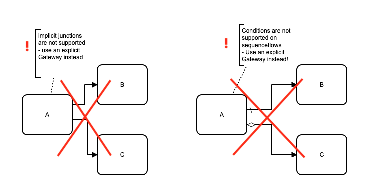
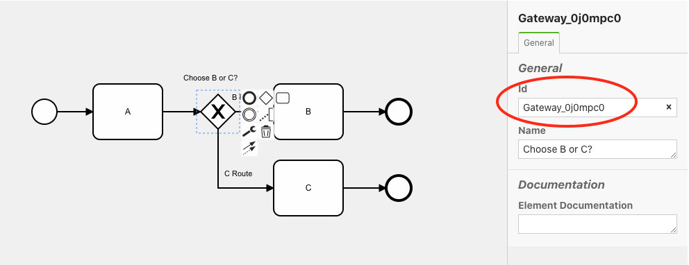
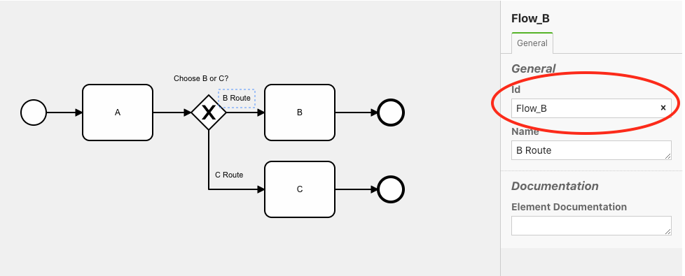
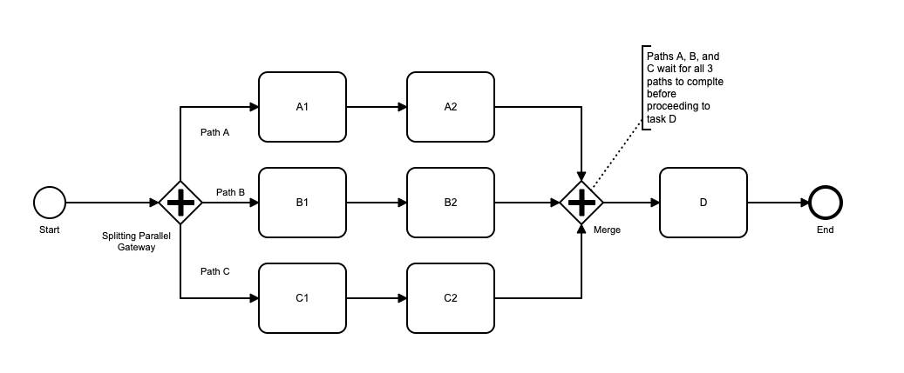
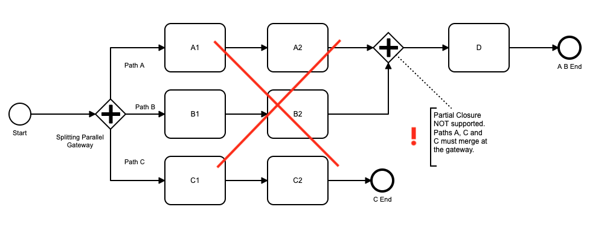
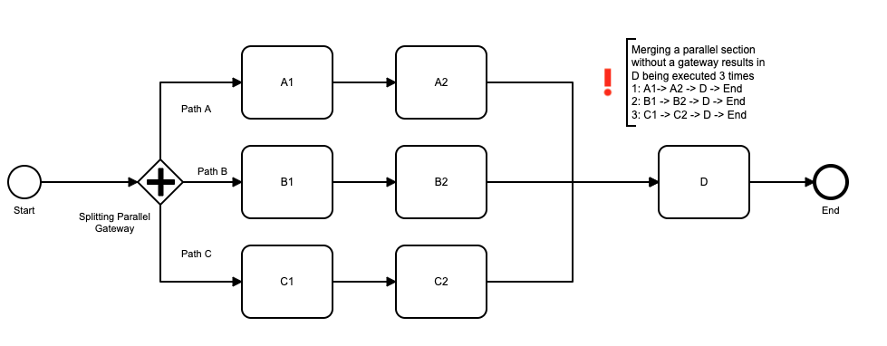
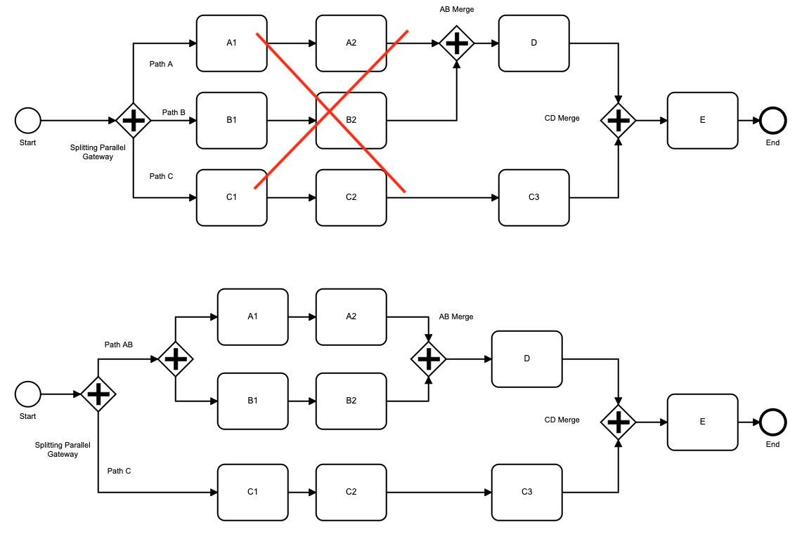
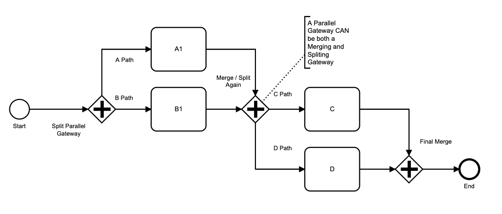
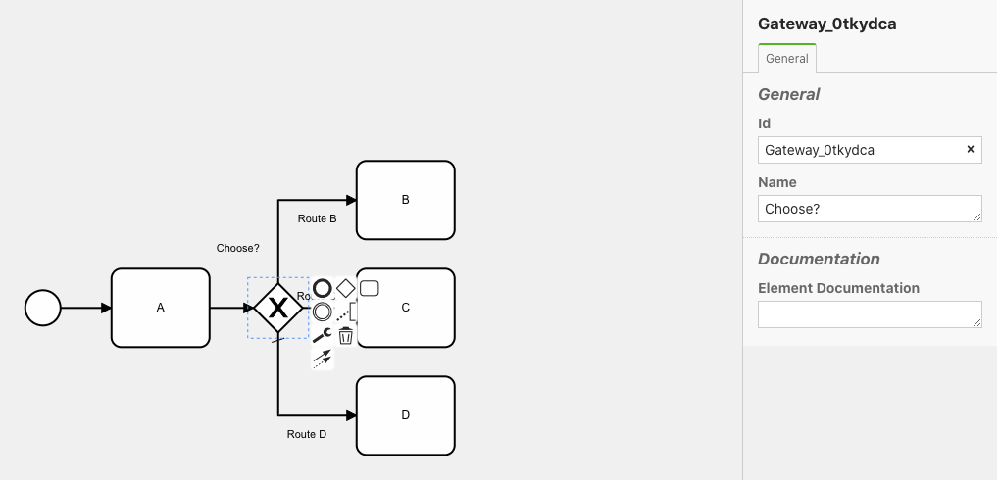
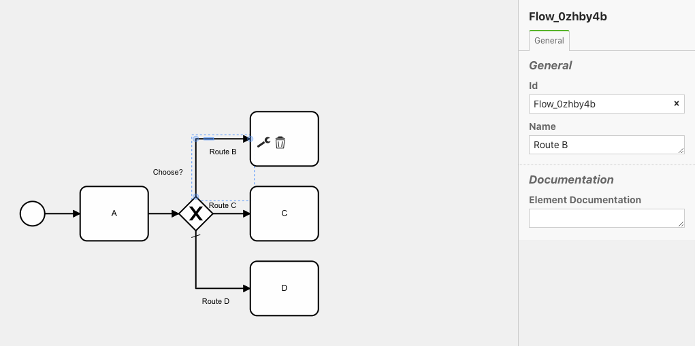

## Gateways and Parallel Flows

### General


In Flows for APEX, BPMN diagrams should use explicit Gateway objects to control process flow.  Flows for APEX supports the following BPMN Gateway objects:

- Exclusive Gateways - where 1 forward path is chosen out of several possible options.
- Parallel Gateways - where several forward paths are defined and ALL execute, creating multiple parallel flows.  At the end of a parallel section, the flows wait for each other at a closing Parallel Gateway before continuing as a single forward path.
- Inclusive Gateway - where one or more forward paths are chosen to operate in parallel.  At the end of a parallel section, the flows wait for each other at a second, closing Parallel Gateway before the process continues forward on a single path.
- Event-based Gateway - where the forward process flow continues down one of several paths, depending on which path an Event occurs on first.  These are covered in more details in the Events documentation.

Flows for APEX does not currently support the BPMN Complex Gateway type.

#### Explicit Gateway Definitions Only

Except for certain exceptions described below, sequence flows that cause flows to split or change direction must be implicitly modeled with Gateway objects.

Implicit process flow splits, or flow control decisions using flow conditions, are not supported.  These process structures can easily be modeled using the gateway types that are available.



### Exclusive Gateways (XOR)

With an Exclusive Gateway, a decision made by the process or by a user allows only one of the possible forward paths to proceed.


As there is only one route taken forward from an Exclusive Gateway, a split section can recombine without requiring a closing Exclusive Gateway.  However, it is generally better style and clearer if a closing Exclusive Gateway is used to end the optional sections of your diagram.

#### Controlling the Forward Path at an Exclusive Gateway (Changed in V5.0).

When a subflow reaches an exclusive gateway, the flow engine chooses the forward path as follows:

1. If a routing instruction is provided, it will take that path.  See 'Specifying a Routing Instruction Below'.
2. Failing that, the Default Path is chosen.  See 'Default Paths on Exclusive Gateways' below.
3. If no routing is provided, and no default is specified, an error is signaled.

#### Specifying Routing Instructions for an Exclusive Gateway (New in V5.0, Changes in v21.1)

An exclusive gateway will look for its routing instruction in a process variable named <gateway_bpmn_id>||':route'.

The routing instruction should be the bpmn_id  of the required forward path (sequenceFlow).

For example, in the progress diagram below, the exclusive gateway 'Choose B or C?' has a bpmn_id of `Gateway_0j0mpc0`. So in a process step before reaching the gateway, your application would need to set the process variable `Gateway_0j0mpc0:route`.



Assuming for the sale of this example that you want to take 'B Route' so that the process goes next to task B, the variable needs to have a varchar2 value set to the bpmn_id of 'B Route', which is 'Flow_B'.  You can set these variables using the `set_var` procedure in flow_process_vars package.



```
Variable  :  Gateway_0j0mpc0:route
Value     :  Flow_B   ----(varchar2)
```
There are several ways to set up the process variable to contain your routing instruction:

- you could set the process variable as part of your processing in an earlier step.  For example, if an earlier task has a manager approve or reject a document, the process step in the application could set up  the routing instruction for a following gateway based on the approval decision. In v5, adding this would be implemented by including a PL/SQL `set_var()` call in APEX page processing; from v21.1, this can be done declaratively using the Flows for APEX manage flow instance variables plugin.
- you could have a scriptTask step that runs automatically before the gateway to set the routing instruction.
- you could use a process variable expression defined in BPMN model to set the variable based on a function or a SQL query, etc., defined to execute in the pre-split processing of the gateway. (new from v21.1).

#### Default Paths on Exclusive Gateways (New in V5.0)

Note that the diagram above contains a small tick mark on the path from the exclusive gateway to task C1.  This denotes that this is the default path.  If the conditions for path A ( sales > 2000 ) and path B ( sales < 50 ) are not met, the gateway will choose the default path.  Processing continues on task C1 on path C.

### Parallel Gateways (AND)

At a Parallel Gateway, all forward paths proceed in parallel with their own subflow.  The incoming subflow is halted with status of 'split'.



Adding a second Parallel Gateway causes the parallel workflows to merge and re-synchronize.  In the diagram above, Path A, Path B and Path C all wait at the Merging Parallel Gateway until all three paths have completed, before a single path proceeds to task D.

A parallel workflow does not have to re-merge and re-synchronize.  You can have all of the forward paths proceed to their own process end events, so shown in this diagram.


Note, however, that merging and synchronization has to occur either for all of the parallel flows, or for none of them.  Having 2 of the forward paths re-merge, but one continue to it's own end -- as shown in the diagram below - is not supported.



A parallel workflow that merges should usually be merged with an explicit merge / re-synchronize gateway.  The following scenario shows an implicit merger, without a closing Parallel Gateway.  If you created this workflow, note that all of the parallel paths will continue to execute Task D and then end.  So D would be executed 3 times.  While you might have a business process where this is the desired behavior, this is likely to be unusual!



It's usually fairly easy to re-write process structure to create balanced gateway pairs, without impact on the actual business process.  The following example takes a nested pair of gateways that are unbalanced, and rewrites them as two balanced pairs of Parallel Gateways to achieve the same process workflow that can be handled by Flows for APEX.



A merging Parallel Gateway can also be used to merge, synchronize, and then re-split the flow -- as in the following diagram.



Flows for APEX does not support a standalone parallel gateway as a merging event.  Merging can only be done for workflows that were earlier split by an equal Parallel Gateway.

### Inclusive Gateways (OR)

An Inclusive Gateway allows one or more of the possible forward paths to occur, in parallel.  In many ways, this can be thought of as a cross between the Exclusive Gateway and the Parallel Gateway functionality.  With an Inclusive Gateway, a decision made by the process or by a user allows one or more of the possible forward paths to proceed.


In this example, the business process of a manufacturer allows goods to be shipped by air, by sea, and to have additional consumer packaging added.  One, two, or all three of these options can be chosen.  The processes merge / re-synchronize at the matching closing Inclusive Gateway, labelled "ABC Merge", before proceeding to task E.

Like with Parallel Gateways, Inclusive Gateways must either:

- occur in a balanced pair, where all of the options start at one opening Inclusive Gateway and then all end at a matching closing / merging Inclusive Gateway, or
- start with an Inclusive Gateway, and then all of the optional parallel paths proceed to their own end events.

At the merging / closing Inclusive Gateway, all routes that were started must complete at the gateway before the single forward path commences.  This re-synchronizes the overall process before it continues.

If no closing gateway is included, all routes must proceed to their own end events, as in the diagram below.


Starting from v21.1, an Inclusive Gateway can now act, simultaneously, as both a Merging / Closing gateway and an Opening Gateway, in the same way that a Parallel Gateway does.  Some experts advise that this is not good BPMN practice as users can get confused by the concept, and so the BPMN Modeler will give you a warning if you include this in your diagram.  But it works!

Controlling the Forward Path at an Inclusive Gateway (Changed in V5.0).

When a subflow reaches an exclusive gateway, the flow engine chooses the forward path as follows:

1. If a routing instruction is provided, it will take those paths.  See 'Specifying a Routing Instruction Below'.
2. Failing that, the Default Path is chosen.  See 'Default Paths on Exclusive Gateways' below.
3. If no routing is provided, and no default is specified, an error is signaled.

#### Specifying Routing Instructions for an Inclusive Gateway (New in V5.0)

An exclusive gateway will look for its routing instruction in a process variable named <gateway_bpmn_id>||':route'.

The routing instruction should be the bpmn_id  of the required forward path (sequenceFlow).  If more than one paths are required, these should be colon `:` separated.

For example, in the progress diagram below, the exclusive gateway 'Choose B or C?' has a bpmn_id of `Gateway_0tkydca`. So in a process step before reaching the gateway, your application would need to set the process variable `Gateway_0tkydca:route`.



Assuming for the sale of this example that you want to take routes B and D, so that the process starts 2 parallel forward routes going next to tasks B and D, the variable needs to have a varchar2 value set to the bpmn_id of 'B Route' and 'D Route', which is `Flow_05d0ha9:Flow_0zhby4b`.  You can set these variables using the `set_var` procedure in flow_process_vars package.




```
Variable  :  Gateway_0tkydca:route
Value     :  Flow_05d0ha9:Flow_0zhby4b   ----(varchar2)
```

Typically you would set these routing instructions into a variable as part of a Task step, or you might have a scriptTask that sets it based on a database query.  If it is a user decision, you would create an APEX Page for the user to review some information and make a decision.  If the routing can be looked up or calculated, a scriptTask could run a PL/SQL procedure that does the appropriate query and processing to make the decision.

#### Default Paths on Inclusive Gateways (New in V5.0)

Like Exclusive Gateways, Inclusive Gateways can also have a single default path which is enabled if no other path is chosen.

