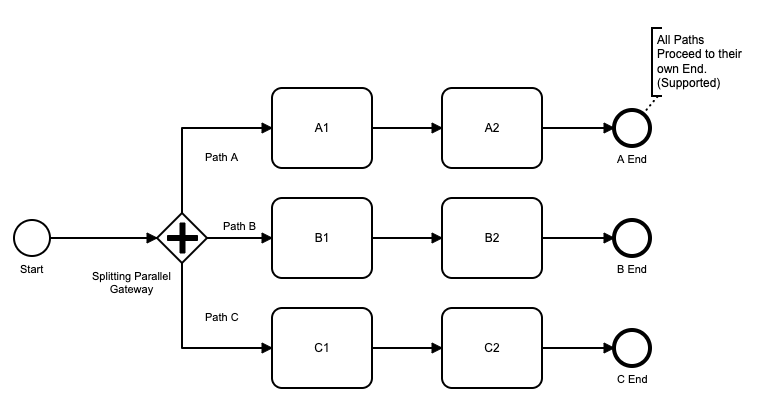
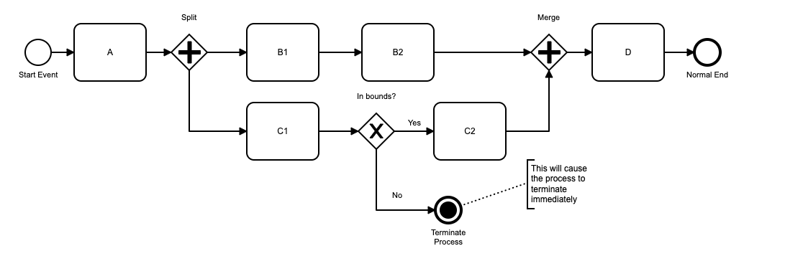

## Starting and Ending Processes

### General

All process diagrams must start with a Start Event and with one or more End Events.

### Start Event

All processes must start with one (and only one) Start Event.

Good BPMN style would say that a Start Event should be named with a verb and a noun to describe the starting status.  Examples would be 'Receive Order' or 'Employee Resigns'.

### Start Event with Timer Event

A Start Event may contain an optional Timer Event.  This will delay the start of the process until a defined time, until a delay occurs (duration), or on a repetitive basis (cycle).

To define a Timer Start Event, first drag a Start Event onto your new process canvas.   Select the 'Change Type' spanner icon on the pop-up menu, and select Timer Start Event from the menu.  To then specify the Timer Configuration, use the Properties Panel on the right of the screen.  Under Timer, select the type of timer you want.  Under Timer Definition, specific the required time or interval, as below.

- Date:  specifies a date and time for the process to start, using an [ISO 8601 date/time string](https://en.wikipedia.org/wiki/ISO_8601#Combined_date_and_time_representations).
- Duration:  specifies a delay from the current time or the process to start, using an [ISO 8601 duration](https://en.wikipedia.com/wiki/ISO_8601#Durations) string.
- Cycle Timer: ~~for an initial run and then repeats an defined intervals, using a [ISO 8601 Repeating Interval](https://en.wikipedia.org/wiki/ISO_8601#Repeating_intervals) specifier.  The alternate BPMN syntax for repeating intervals using CRON syntax is not currently supported.~~ Cycle timers are not currently supported, and are disabled from the modeler in v21.1

For more information on Timer Events, see the documentation Timer Events page.

### End Event

A process must be defined with at least one End Event, which ends the process on that process branch.

A process can be defined with more than one End Event if it has multiple branches.  Each branch should have an End Event.

When the final End Event is met for a Process, the Process Instance is complete.

### Terminate End Event

A Terminate End Event in the top level of a Flow (i.e., not in a sub process) will terminate all current branches running in the flow, and cause the flow instance to complete.
Flow process variables are maintained when the flow instance terminates.

Terminate End Events can be used in a Flow model for two main purposes:

- to trap process errors, and end model processing once an error is detected
- to ensure that all elements in a complex model stop when the business process has finished.

Flows for APEX allows you to specify the status of your Instance after a Terminate End Event.  If your Terminate End Event is trapping an error, and ending the process in an abnormal state, you might want the instance status to be set as `terminated`;  If the terminate end represents a normal process ending, you would want your instance to have a status of `completed`.  The Flow Modeler properties panel allows you to specify which status should be used when the Terminate End Event is processed. (By default, it will be marked as `completed`).

A Flow instance can also be terminated from the flows4APEX PL/SQL API using the `flow_terminate()` call, which has the same effect as processing a Terminate End Event in a flow model.  The Flow Modeler page of the Flows for APEX application allows an administrator to do this from its interface.  An Instance which has been terminated from the API always has its instance state set as `terminated`.

#### Terminate End Events in a Sub Process.

Terminate End Events may also be put into in any sub-process diagram.
The behavior of a Terminate End Event in a sub process is to immediately end processing in the sub process, and return control to the next object in the immediate parent process.
Note that if the sub process has an error boundary event defined on it, the terminating sub process will NOT return to the error handler; it returns to the next event on the normal forward path.
Any nested child sub processes that are running below the the sub process containing the terminate end event, are also terminated.
