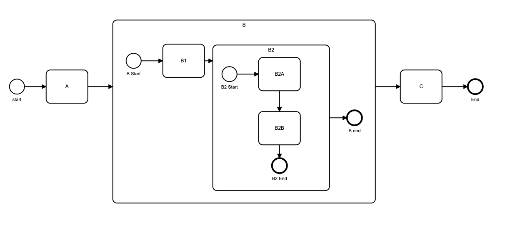

## Sub Processes

### General

BPMN allows encapsulation and detail hiding through the use of Sub Processes.  These can be defined in a diagram, allowing the details of a process to be hidden from the top level process.

Flows for APEX allows you to create sub processes within your process.  Sub processes can contain other sub processes, and so a deep hierarchy of processes and sub processes can be built.  There is no arbitrary limit to how deep sub processes can be stacked -- although everything must be contained in a single BPMN diagram currently.

All sub processes currently are embedded sub processes.  Global sub processes, which can be called from a different diagram, are not yet supported.

### Creating Sub Processes

Sub Processes are created using the modeller, as usual.

### Boundary Events on Sub Processes

Starting with Flows for APEX V5.0, Sub Processes can have Timer, Error ad Escalation Boundary Events added to them.  See [Behaviour Of Boundary Events in SubProcesses](behaviourOfBoundaryEventsinSubProcesses.md)

### Terminate End Events in Sub Processes

Starting with Flows for APEX V5.0, a Sub Process can contain a Terminate End Event.  If a Terminate End Event is reached, all processing in the sub process, along with any processing in  nested child sub processes running inside it, are terminated.  Control passes to the next event in the normal exit path to the sub process in its immediate parent process.

## Rules for Sub Processes

#### 1. Sub Processes must have a single Start Event.

A Sub Process must start with a single Start Event, which should be a simple Start Event (i.e., without any associated Timer, etc. event).

#### 2. End Events

A sub process must have at least one End Event.  If more than 1 end events are specified, the sub Process waits for all active subflows to complete before returning to its parent process.  (It may have additional non-standard end events, such as error end events, etc.).

#### 3. All Sub Processes are currently Embedded Sub Processes and Operate in a Single Lane.

As is correct for an embedded BPMN sub process, a sub process must operate in a single lane.  All sub processes are currently embedded sub processes - callable sub processes are not yet supported.

#### 4. Event Sub Processes are not yet supported.

#### 5. Sub Processes and Subflows.

When a subflow reaches a Sub Process object, the subflow gets a status of 'In Subprocess'.

Processing in the SubProcess starts on a new subflow, which is running at the subprocess level.

Subflows inside a sub process can themselves split at parallel or inclusive gateways, creating new subflows running at the sub process level.  They can also start a new child sub process -- in which case the new parent sub process gets status 'In Subprocess', and its new child starts new subflows at the new sub process level.

For a sub process to complete normally, all subflows running at the subprocess level must complete by reaching end events.  When the last runing subflow in a process level completes normally, the subprocess has completed, and processing continues on its parent subflow.

If a subflow triggers a non-interrupting boundary event, it will cause a new subflow to start on its parent's process level.

If a subflow triggers an interrupting boundary event, for example an error event or an interupting timer or interrupting escalation, all processing inside the subprocess is stopped, and the subprocess' parent subflow continues on the path forward from the boundary event, if defined.
