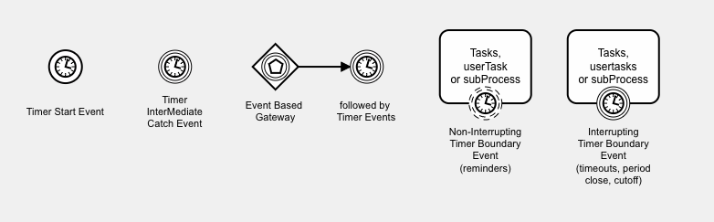
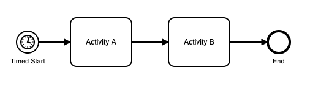
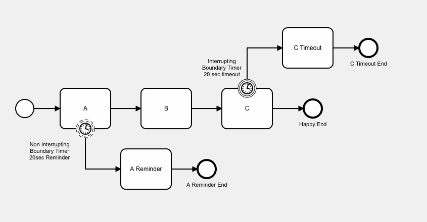
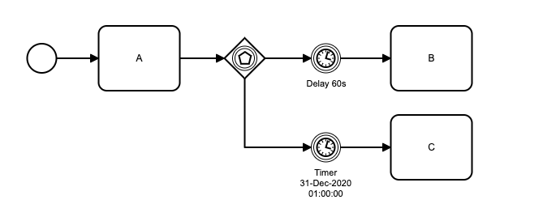
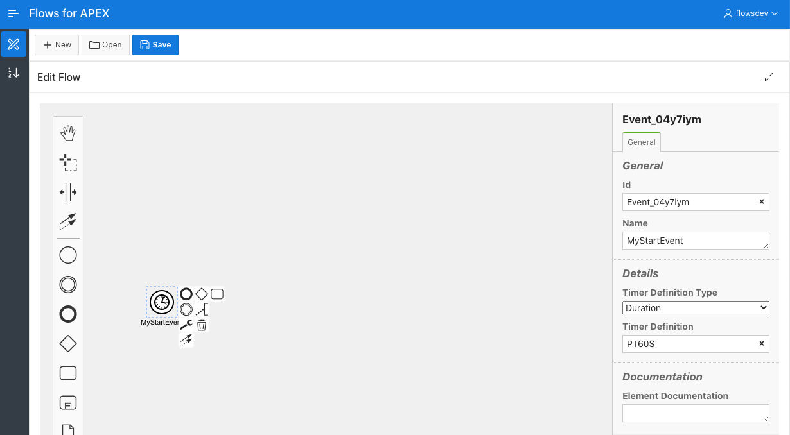
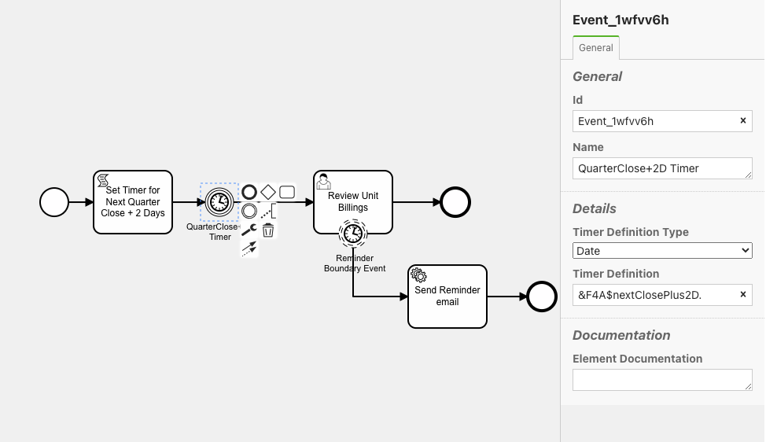

## Timer Events

### General



Timers are currently supported on the following event objects:

- Start Event - Timer controls when the process starts.
- Intermediate Catch Event - the timer delays the process flow and controls when the process moves on to the next event.
- Timer Boundary Events - interrupting and non-interrupting timer boundary events can be set on tasks, userTask, and subProcess objects to implement reminder, timeout, and period closing processes.
- Event Based Gateway.  Timers can be used following an Event Based Gateway.  The Event Based Gateway choses which single path is taken, based on which Event occurs first.

When using timers, the properties viewer window is used to specify the timer type and details.[](#)

The Timer sub-system requires additional database privileges and configuration, so you might need to configure your timer sub-system and check that it is working correctly if you have not used timers before on your system.

## Timer Start Event

The Timer Start Event allows a process start to be delayed so that it occurs at a particular date & time, after a delay, or on a regular scheduled basis.



## Timer Intermediate Catch Event

A Timer Intermediate Catch Event will cause the sequence flow to wait until the timer fires, thus causing a delay to the sequence flow.


## Interrupting Timer Boundary Event

These can be set on a task, a userTask, or a subProcess.  When this object becomes the current task, a timer is started.  If the object is still the current object when the timer fires because it has not yet been completed, the underlying task is terminated, and the timer boundary event becomes the current object.  It performs a task_complete on the boundary event, moving the process on to the next step.
These are used to perform a business process timeout -- the usual forward path is suspended, and replaced by the timeout process path.  This can also be used to move a process on after a period closes or a review period has completed.
Only one interrupting timer can be set on a single object.
In the example below, task C has an attached interrupting timer.  If task C is completed before the timer fires, the timer is removed.  If the timer fires before C has completed, processing switches from the normal path and instead continues with C Timeout as the next task.



## Non Interrupting Timer Boundary Events

These can be set on a task, a userTask, or a subProcess.  When this object becomes the current task, a timer is started.  If the object is still the current object when the timer fires because it has not yet been completed, the underlying task continues, and a new subflow starts to operate in parallel to execute the 'reminder' path.  The new 'reminder path' performs a task_complete on the boundary event, moving the process on to the first task on that path.
Non-Interupting Timer Boundary Events are used to implement reminder processes, or to start time-delayed parallel process paths.  If the underlying task completes before the timer fires, the 'reminder path' timer and associated subflow are deleted.
Multiple non-interrupting timer events can be set on a single task, userTask, or subProcess.
In the example above, task A has one non-interrupting boundary timer attached to it.  If task A is not completed in the given 20 seconds, the timer fires - which starts task 'A Reminder' on a parallel subflow to the main subflow.

## Event Based Gateway with Timer

An Event Based Gateway is followed by one or more event-based Intermediate Catch Events.  When the process flow gets to the Event Based Gateway, all of its following catch events wait for their respective event to occur.  When the event occurs, the process proceeds along that path.   All other paths forward from the Event Based Gateway are terminated.


In this example, the Event Based Gateway is followed by 2 forward paths.

- The  route towards Activity B has a duration timer that causes a 60 second delay.  This event will fire after 60 seconds.
- The route towards Activity C has a date timer that is scheduled to fire at 01:00:00 hours on 31st December, 2020.

Let's assume that the first event to fire is the 60 second timer on route B.  When this fires, the process will move forward to Activity B.  The timer waiting on the path to activity C will be terminated, and activity C will not occur.

## Setting Up the Timer System

Use of the Timer sub-system relies on the DBMS_SCHEDULER feature of the Oracle server.

The timer subsystem requires the parsing schema to have been granted the CREATE JOB system privilege.

In addition, the schema needs to set up a program and a job in the DBMS_SCHEDULER system.

For details, please see the setup file included with the Flows for APEX distribution at /setup/DBMS_SCHEDULER_setup_for_timers.sql.

## Timer Syntax

To define a Timer Event, first drag the Event onto your new process canvas.   Select the 'Change Type' spanner icon on the pop-up menu, and select Timer version of that from the menu.  To then specify the Timer Configuration, use the Properties Panel on the right of the screen.

Timer definitions can be specified in the properties panel as a literal value, or can be specified using a process variable substitution.

Under Timer, select the type of timer you want.  Under Timer Definition, specific the required time or interval, as below.

- Date:  specifies a specific date and time for the process to start, using an [ISO 8601 date/time string](https://en.wikipedia.org/wiki/ISO_8601#Combined_date_and_time_representations).  For example:

  ```
  2007-04-05T14:30
  ```

  You can also specify a date value by creating a Flows for APEX process variable of data datatype, and substituting that.  See below for syntax.


- Duration:  specifies a delay from the current time or the process to start, using an [ISO 8601 duration](https://en.wikipedia.com/wiki/ISO_8601#Durations) string.  For example:

  ```
  P3Y6M4DT12H30M5S" represents a duration of "three years, six months, four days, twelve hours, thirty minutes, and five seconds".
  P3M represents 3 months.
  PT5M represents 5 minutes.
  PT30S represents 30 seconds.
  ```
- Cycle Timer: specifies the date/time for an initial run and then definied intervals for repitition.  **__Although they can be specified in the Flow Modeler, Cycle Timers are not currently supported in Flows for APEX.__**

  To start a process repetitively, use APEX Automations.

  ```

  ```



## Substituting Process Variables into Timer Definitions

Starting in V5 (5.0.1), the timer definition defined in your process diagram can be a Flows for APEX process variable.  This provides considerable process flexibility, especially with Date type timers.

To specify a process variable in the BPMN Modeller - Properties Panel, you specify the variable with &F4A$ prefix and a period (.) suffix.  So the process variable

```
my_timer    could be specified as &F4A$my_timer.
```

For a Timer Definition Type 'Date', the process variable should be of type DATE.

For a Timer Definition Type of 'Duration' or 'Cycle', the process variable should be of type VARCHAR2.

In the following example, a scriptTask is used to calculate a process variable, `nextClosePlus2D`, which contains the date of the company's next finacial close plus 2 days.  This variable is then used to set an Intermediate Timer Catch Event.  The Timer on this event is set to fire at `nextClosePlus2D`.  You can see how this has been specified on the Timer Definition, using the Flows for APEX process variable substitution syntax.



Just to keep the example going, our Review process, which is triggered by the Intermediate Timer Catch Event, itself has a non-interrupting timer boundary event set on it.  This acts as a reminder, and is set to fire after a Duration has elapsed after the Review Event became the current task in the process.  This has also been specified using a substitution variable - this time using the variable `managerReminderPeriod`.  If this was, say, 2 days, the process variable `managerReminderPeriod` would be a `varchar2` variable having the value `P2D`.
