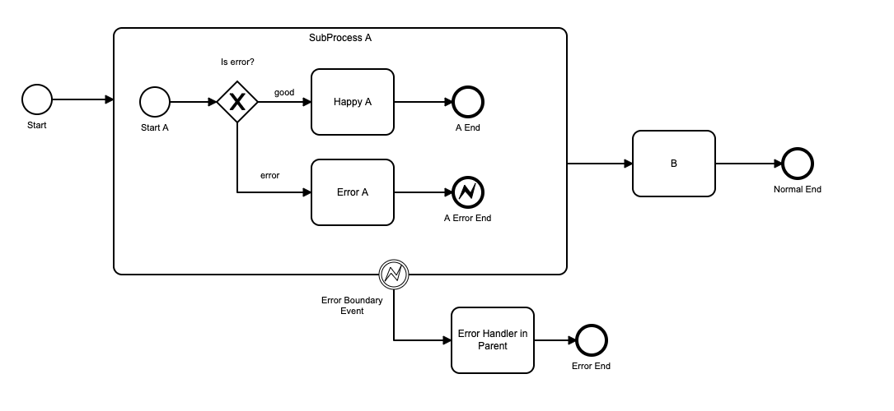
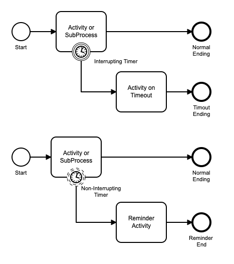
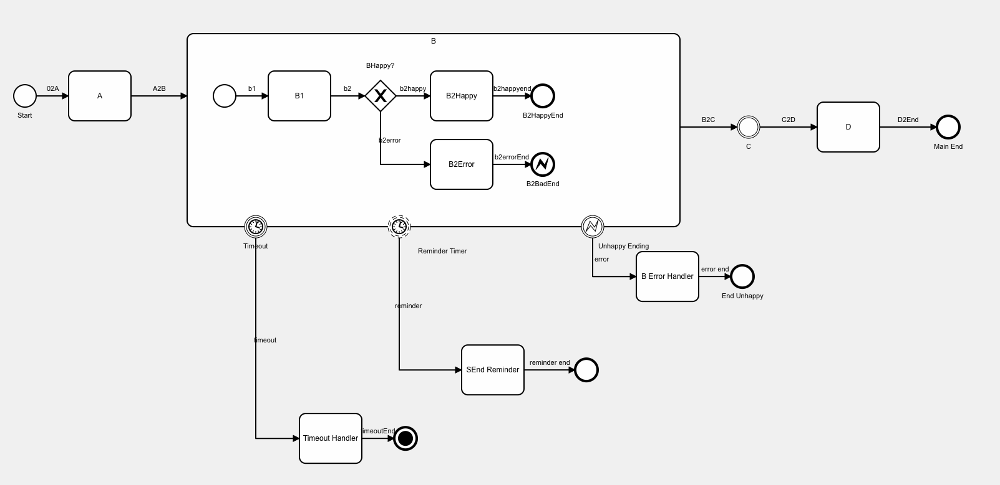

# Behavior of Boundary Events in Sub-Processes (New in V5.0)

This is where things get a little complex - but understanding and mastering boundary events will help you build powerful business processes without getting distracted by all of the painful details of handing process errors, escalation, and all of those other things that turn your simple process model into spagetti!

One of the good practice modeling concepts  in BPMN is to focus the model on the usual, happy-case path.  So your model should flow, left to right, along the happy case scenario.  The mess of error handling and special cases should be abstracted to the top and bottom of your model.

Boundary Events come in several flavours, to handle:

- process errors
- process escalation
- timeouts
- reminders
- interruptions

Boundary Events can be attached to tasks (and task like activities) and to sub-processes.  This setion covers behaviour of boundary events when applied to sub-processes only.

### Error EndEvents and Error Boundary Events.

This process has a SubProcess A.  In the sub-process, there is an exclusive gateway 'is error?' which tests for a process error.  If there is a *process error*, the process ends at an Error End Event.

Note that an error in this context is a *process error*, not a technical error in the application -- which would be handled by the application technology.

Behaviour is:

- An Error End always interupts processing in the sub-process.  Processing in the sub-process, and any of its running child sub-processes, are terminated.
- Terminated objects are not marked as having been completed on the progress chart.
- If the immediate parent process contains an Error Boundary Event, processing continues on that path in the immediate parent.
  - In the  example above, the path would be: Error A -> A error End -> Error Boundary Event -> Error Handler in Parent -> Error End.
- If the immediate parent process doesn't contain an Error Boundary Event, processing continues on the normal path in the immediate parent.
  - In the example above, if there is an errorEnd but NOT a error Boundary Event defined, the path would be: Error A -> A Error End -> B -> Normal End.

### Timer Boundary Events

Timer Boundary Events can be *interrupting* or *non-interrupting*.

- An *interrupting timer boundary event* can be used to create a "timeout" after a specified time period or at a specified time.  When the timer fires at the specified time, processing of the sub-process and any child sub-processes is interrupted.  The parent subflow continues along the route forward from the interrupting timer boundary event.  You can only have one interrupting timer boundary event attached to an object.
- A *non-interrupting timer boundary event* can be used to create a reminder  after the process step has been started for a specified time period, or at a specified time.  When the timer fires, processing of the parent task continues.  In addition, a new subflow processes tasks on the reminder route.  You can have one or more interrupting timer boundary events attached to an object, firing at different times or triggering different process tasks.

A more complex example of how these can be used together is shown below.

In this example, sub-Process B has 3 boundaryEvents attached to it.  In addition to the Error Exit Event and corresponding Error Boundary Event for handling the error in the parent process, there are 2 timer booundary events.

The Reminder Timer is set to fire after 2 days.  This is a non-interrupting timer.  When it fires, a reminder is sent to the user on a new subflow.  If Task B is completed before the boundary timer fires, the timer is terminated.  If the reminder timer fires, it starts a new subflow with Send Reminder as it's next task; Once the timer has fired, the subflow will continue to exist after the attached parent task (B) has been completed.

The TimeOut Timer is  set to fire after 5 days.  This is an interrupting timer.  when it fires, and processing inside sub-process B is terminated.  The subflows that are running to execute sub-process B are terminated.  The main subflow (which went from Start -> A -> B) proceeds to Timeout Handler.  C and D will not be executed.

### Escalation Events

Escalation events are used in a subprocess to signal an event or condition outside of the normal, but which is not a process error.  Escalations can be thrown by both intermediateThrowEvents and endEvents.  Both of these can throw interrupting and non-interrupting escalation events.
