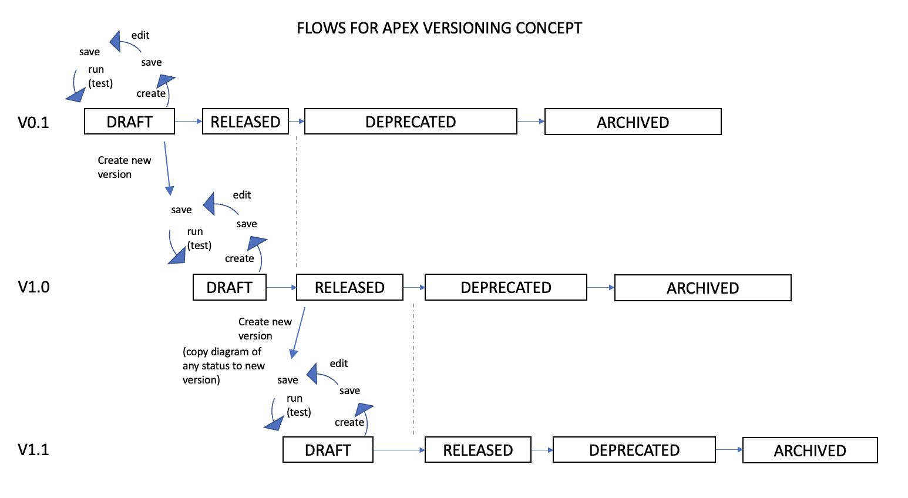

## Process Versioning (New in V5.1)

### Concept

If you are running a process in a production environment, what happens when you need to change your process?  If you change the process, what happens to process instances that are currently running ("in-flight")?  How can I manage my processes through their lifecycle?

Process Versioning is a set of features that help you manage these issues.

Each Process Diagram is identified by the process diagram name and version.  The version is freetext, and can support any version numbering scheme that you want.

A Process Diagram also has a status.  A diagram would normally start off with a status of `draft`.  You might then edit this, save it again (without changing the version), then run it to test your process.  You might go through this cycle several times, edit, save, test...until you have a working process.  You can do anything to a `draft` document.

Once you have a tested process diagram that is ready for production use, you can change it's status to `released`.  A released document can no longer be edited.  Only one version of a process diagram name can exist in `released` status at any one point in time. If you start a process instance without specifying a version, Flows for APEX will start the version that is in `released` status.

If you want to change the process, you would create a new version of the process diagram.  You can copy a diagram of any status to create your new version.  This new version would start with a status of `draft` while you edit and test it.  Once you are ready to move this new process diagram into production, you then change the status of the old process diagram to `deprecated` and change your new diagram to a status of `released`.  The new `released` process diagram will now be used to start any process instances.  Any process instances that are still running (in-flight) will continue to use the now `deprecated` process diagram that they were started with.

In order to protect running processes, diagrams that have a status of `released` or `deprecated` should not be edited or deleted.

Once all process instances have completed running, the process diagram can be changed to a status or `archived`.  Archived processes can be retained on the system for audit and reporting purposes, but can't be started or edited.

Most Flows for APEX users with production systems will need to use Process Versioning to support the lifecycle of their business processes.  However, use of versioning is not required.  By default, all diagrams are created with a version of "0" and a status of `draft`.  All functions of  Flows for APEX can be used with `draft` process diagrams without having to worry about status; however, production processes will not be protected from editing, and in-flight processes may cause errors if their diagrams are changed while they are running.

### Status Rules

| status | draft | released | deprecated | archived |
| :--- | :---: | :---: | :---: | :---: |
| create a new diagram | :+1: | - | - | - |
|  can edit diagram |  :+1: | 🛑   | 🛑  |  🛑 |
| can delete diagram |  :+1: | 🛑   | 🛑  |  :+1: |
|  start a new instance |  :+1: |  :+1: | 🛑  |  🛑 |
| continue to run an existing instance | :+1: | :+1: | :+1: |🛑  |
| can be copied to a new version | :+1: | :+1: | :+1: | :+1: |
| can be exported | :+1: | :+1: | :+1: | :+1: |

#### Application changes when processes change

Depending upon the nature of changes that you make between process diagrams, your applications might need to be aware of the process version.

