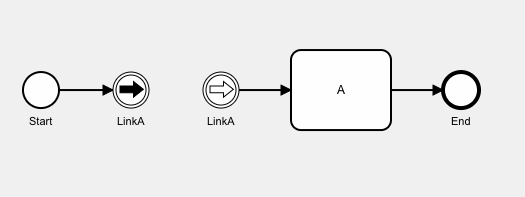

## Link Events (New in V5.0)

* A Link is a mechanism for connecting two sections of a Process.
* Link Events can be used to avoid long Sequence Flow lines.
* The use of Link Events is limited to a single Process level (i.e., they cannot link a parent Process with a Sub-Process or one pool to another pool).
* There can be multiple source Link Events, but there can only be one target Link Event.
* In V5.0, the Name property of the throwing event(s) and the catching event must be identical.  For the avoidance of doubt, this is the 'Name' field in the diagrammer, not the 'Details - Link Name' property, which is currently not used.
