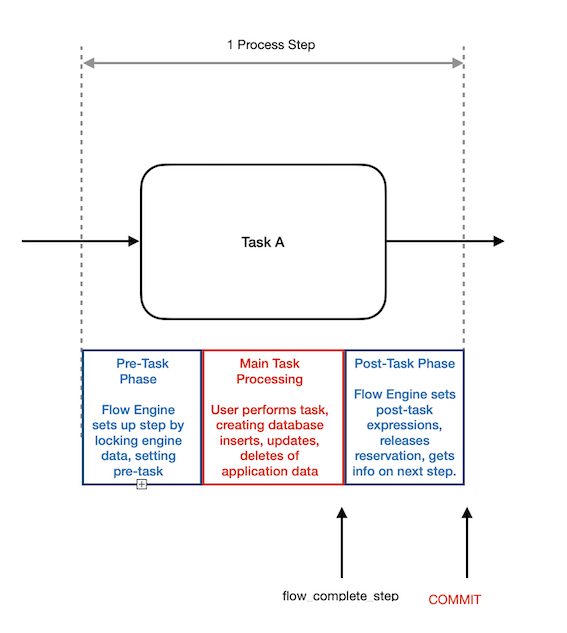
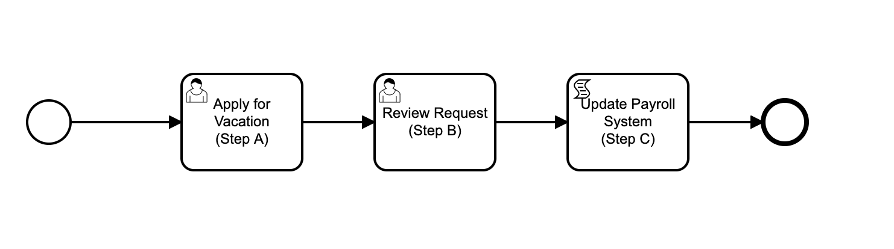
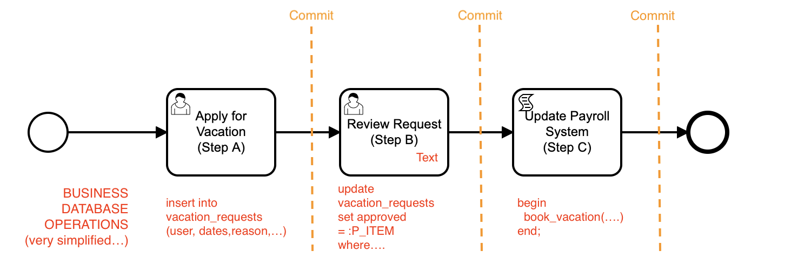
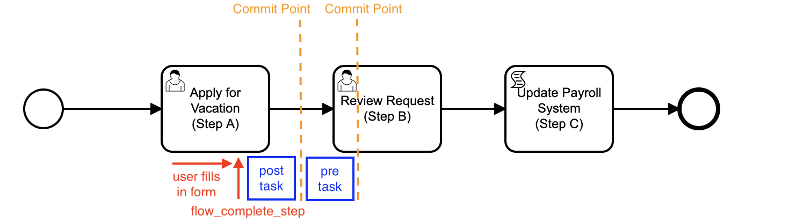
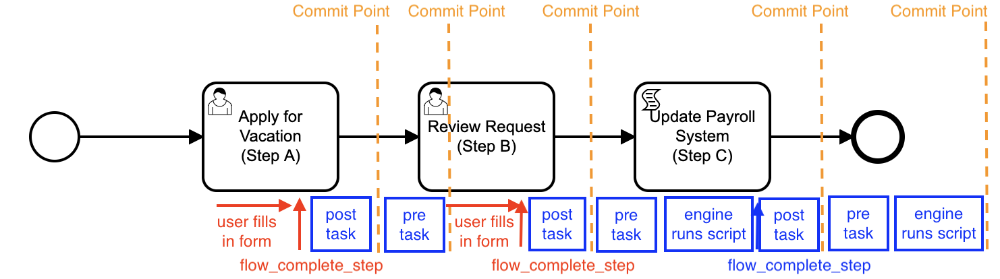
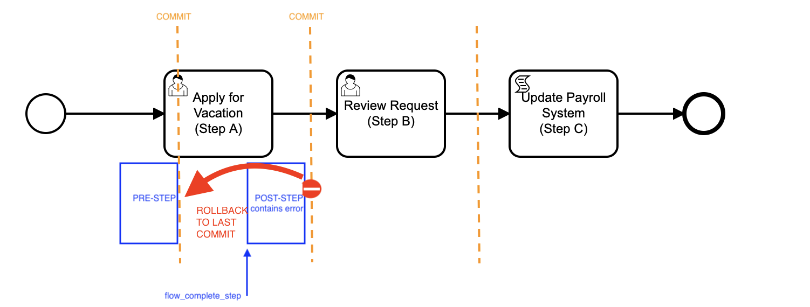
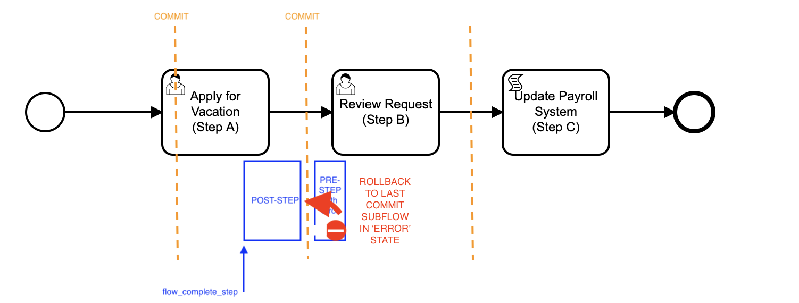
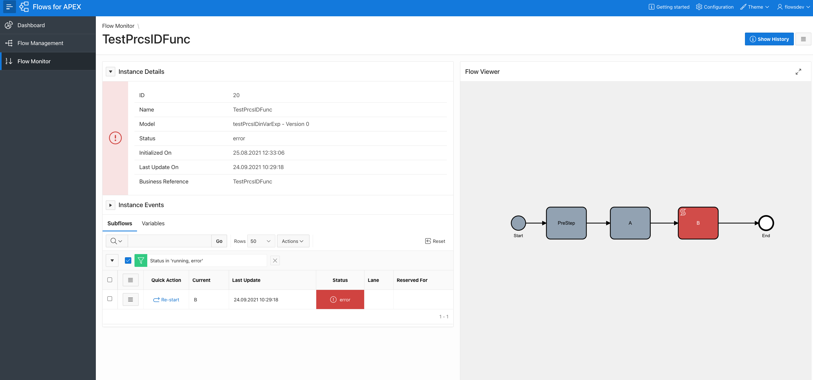
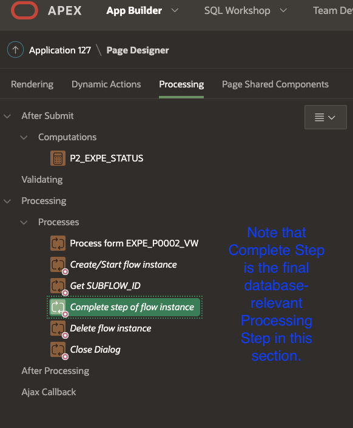
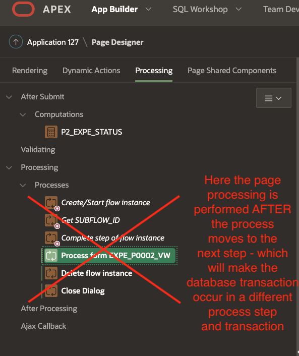

# The Flows for APEX Transactional Model

### Summary

🆕 Flows for APEX v21.1 introduces a transactional model which changes behavior from earlier releases.  Developers should be aware of the Flows for APEX Transaction Model before designing applications using Flows for APEX.

### Connecting Database Transactions and Process Steps

Database developers should be used to the concept that a **database transaction** moves the database *from one correct and complete state to another correct and complete state*.  In a well designed system, this transaction usually represents a business transaction that moves the business from one state to another.  And this is implementing by committing the entire transaction to the database if it succeeds, or rolling back the transaction if it fails.

A BPMN business process step is a similar concept:  requesting  to complete the current step and move forward to the next step in the business process is saying that the current step is complete and the process should move on to the next process step.

In a typical implementation of a business process, each activity in the Process Model would be implemented as a database transaction.  Sometimes a step might do several database transactions, but then the step would be responsible for managing the coordination of transactions within a step.  But a  transaction shouldn't normally span multiple process steps.

The intended use case for Flows for APEX is that all of your database activities (inserts, updates, deletes) that make up a process step,  **and** all of the Flow engine work required to facilitate a process step -  all occur together in a single database transaction.  This means that the entire process step is committed into the database, or is rolled back if something interrupts processing.

### Flows for APEX Transaction Model

Each step that processes a bpmn Task (task, userTask, scriptTask, manualTask, serviceTask) can be broken into 3 phases:

1. Pre-Task Phase: prepares the new step for processing by:
   1. locking the subflow and required related objects.
   2. starting any boundary event timers.
   3. evaluating any 'before task' variable expression sets.
2. Main Task Processing Phase:
   1. For an asynchronous task requiring input from the user:
      1. The pre-Task Phase is `committed`, as the engine is now waiting for the user to perform his task.
      2. a URL containing the task is made available to the user via the task inbox view, and the models waits for the user to signal that they have completed the task by calling `flow_complete_step`.
   2. For synchronous tasks, such as scriptTasks or serviceTasks:
      1. these tasks are automatically run by the engine.  Note that the script should not normally contain its own `commit` statement.
      2. on completion of the script or service call, the engine itself generates a flow_complete_step` to move into the post-task phase.
3. Post-Task Phase: The engine completes the step and prepares to move forward to the next step by:
   1. locking the subflow and required related objects if they are not already locked.
   2. removing any task reservations.
   3. evaluating any 'after task' variable expression sets.
   4. getting information about the next step.
   5. updating the subflow status to show the step as complete.
   6. `commit` the step.
      
      If the step was completed successfully, the engine then moves into the Pre-Task Phase of the next step.

Other object types, such as gateways, sub processes, and events, cause their own step transactions to occur, as appropriate.  As examples:

- splitting parallel and inclusive gateways will perform one transaction on their incoming subflow, before stepping forward with separate transactions on each of their forward paths.
- a pair of link events performs one transaction covering the link throw and link catch events, combined.

### A Detailed Look at What Happens on a `flow_complete_step`.

Let's look in detail at what happens at a very simple 3-step process for processing vacation requests.

When the Process Instance starts, it moves forward to Step A, which requires the user to complete a form.  Task A is *asynchronous*, in that user task A waits for user input and for the user to complete the task before proceeding.  The next diagram shows a very simplified view of the transactions that the APEX forms and the PL/SQL script might be using to update the database, along with the points at which these might be committed to the database - the transaction boundaries.

#### Going from Step A to Step B

Let's look in detail at what happens from the point where the user is completing a form in APEX to apply for their vacation, and we are using Flows for APEX to control the process flow.

We start with the user working on her vacation application, part of Step A, which she is doing by completing an APEX form page.

- when the user submits the page for processing, APEX will perform Page Processing:
  
  - this will do Standard Page Processing (DML) Operations to update the database (the `insert into vacation_requests...`)
  - and directly, or using the Flow Instance Step Operations plugin, the app issues a `flow_complete_step` call to the Flows for APEX engine.
- Flows for APEX will then perform its Post-Step Phase operations for Step A.  These prepare for moving to the next Process Step by:
  
  1. locking the subflow and any required related-objects, if they are not already locked.
  2. removing any task reservations.
  3. evaluating any 'after task' variable expression sets.
  4. getting information about the next step.
  5. updating the subflow status to show the step as complete.
- The user's database transaction and the process step are now successfully completed, and so the Flows for APEX engine issues a `commit` statement to commit step A and move the model forward to step B.

The Process is now on step B.

Flows for APEX performs the Pre-Task Phase operations for Step B.  These include:

1. locking the subflow and required related objects.
2. starting any boundary event timers.
3. evaluating any 'before task' variable expression sets.

Step B is another asynchronous process step, requiring a user to pick up the task, enter some data in an APEX page, and submit it.  So after completing the Pre-Step Phase tasks, the call to 'flow_complete_step' made by the user in Step A is now finally complete.

Now it has completed Page Processing, APEX issues a `commit`.  This commits the Pre-Phase Tasks for Step B.  The URL for UserTask B is now available in the Task Inbox.

#### Going from Step B to Step C to the End Event

Continuing our example, the user is now working on a Step B, which results in some database updates being created as part of the userTask on Process Step B.

This time, the activities performed by `flow_complete_step` are different, because the next step in the process, Step C, is a script Task which is run *synchronously *by the flow engine.  So is the step after this, the End Event.

As Step B was an asynchronous step, the Pre-Step Tasks were performed and committed before the User started to work on the Step itself.

The User does step B, and submits the APEX page to the APEX Engine, which:

- performs the standard DML processing.
- issues a `flow_complete_step` call to Flows for APEX.

Flows for APEX will then:

- Perform the Post-Step Phase operations for Step B
- Then `commit` - which will commit the user work and the Step Change to Step C

Flows for APEX then moves to Step C, and:

- Performs the Pre-Step Phase operations for Step C.
- Step C is a Script Task, so processing continues and the Task C Script gets run.
- After the script completes, the engine issues a `flow_complete_step` itself to move to the next step.
- The engine then runs the Post-Task Phase operations for Step C.
- If no errors, the entire Step B is then committed, and the Process moves to the next step.

The End Event is now the current step.  So:

- the engine runs the Pre-Step Phase activities for the End Event.
- the engine processes the End Event itself... which completes the Process Instance.

Our call to `flow_complete_step` made in the Step B now returns to the user application, and APEX commits the End Event processing.

### Transactions and Errors

Errors occur for a variety of reasons, that can include:

- incorrect BPMN models (reduce this by using the model checker / linter built into the Flow Modeler before saving your model)
- errors in scriptTask and serviceTask PL/SQL code
- errors in process variable expressions, defined in your model
- process variables containing unexpected data
- other unexpected data / data quality issues.
Flows for APEX handles errors appropriately to the step it is being used on.

- if an error occurs in the user's current step of a process, such that the user's current step cannot be completed, an error message is returned to the user as soon as it is detected, and the current step does not complete.  This would occur in the Post-Task Phase of the current step - i.e., in the first Post-Task Phase processed immediately after sending a `flow_complete_step` request.

- Once the user's current step has completed its immediate Post-Task Phase and the current step has been committed to the database, any errors that occur will be in a Subsequent Step.  There might be additional Subsequent Steps if the subflow then processes synchronous tasks, such as scriptTasks or serviceTasks, or gateways or event handlers.

- Any errors that occur when a Subsequent Step is being processed will not return an error message to the user performing the Current Step.  Instead:
  - the error will be logged in the Instance Event Log.
  - the Subsequent Step will be rolled back to the beginning of the Step.
  - the subflow containing the error will be put into `error` status.
  - the Flow Instance containing the error will be put into `error` status.
    
    
    
  - after finding and fixing the source of the error, the Subsequent Step can be restarted from the Flows for APEX application, or from the API using the `flow_restart_step` call.

### Problems to Avoid in Your Application

The transaction model described in great detail above ties your custom database operations and the process step together so that application and process engine work together within the same database transaction -- which will normally be the required behavior.  Flows for APEX and APEX itself effectively work together to commit transactions and process steps at the required points of the transaction / step.  Note that it is Flows for APEX that knows when the process step boundaries occur, and which commits transactions at process step boundaries.

 

As a developer, you should avoid performing transactions that span process steps.  Any work that needs to be performed as part of process step A needs to be performed BEFORE the process is told to move to step B.  In practice, from APEX, this means that the call to `flow_complete_step` should be the final database-relevant step on page processing.  The only processing tasks that should follow the `flow_complete_step` process step would be UI commands, such as, for example, 'Refresh Page'.

### But I really want to take control of my transactions...

If you have an advanced requirement, and want to take responsibility for transaction control yourself (not recommended unless you really know what you are doing...) you could wrap the calls to the Flows for APEX engine in your own autonomous transaction wrappers so that steps can commit separate from the underlying transaction.  If you do this, you have to be very careful to handle any errors that occur, and understand where they will roll back to.  If you think you need to do this, please talk to the Flows for APEX team.

### How is this different to Flows for APEX v5 and earlier?

Prior to v21.1, the Flows for APEX engine would execute as many forward steps as it could, stopping when it reached either an asynchronous (waiting) task requiring user input, or hit an error.  All of the processing would be inside the user's current APEX transaction, which would be committed by APEX at the end of processing;  any error inside the process would cause an error message to be presented to the user, and the entire transaction would be rolled back.  When errors occurred in forward steps, this resulted, for example,  in a user working on process step A being unable to complete step A because of an error in the following step B or Step C, which was being run automatically as a scriptTask.

### Concurrency Control

In general, two (or more) users shouldn't be completing the same step of a process at the same time, as only one will be able to perform the task and move the model forwards.

Applications should handle collision control by using the Reservation mechanism before a user starts work on their task, signaling to other users that they are working on a task.

