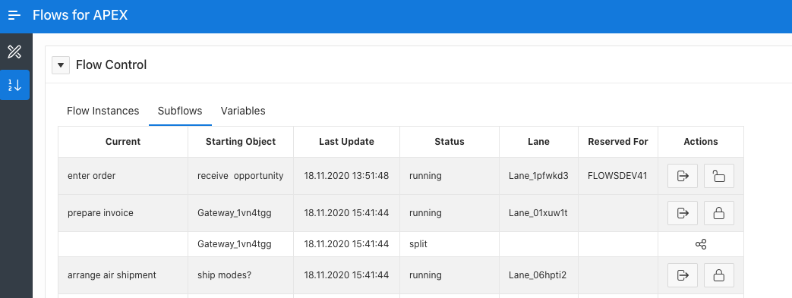

#### Multi User Pools and Task Reservation

If you are using Flows for APEX for task orchestration or have an application where users are provided with a task inbox, all users who are serving a lane will see all of the current tasks in that lane.  
*Task Reservation* provides a mechanism for users who are sharing a lane to record that they are working on a task, or intend to work on a task, so that other users don't also work on the same task.

Tasks can be reserved, by calling the `flow_api_pkg.flow_reserve_step procedure`.  
When you reserve a step, you supply a `reservation` as the `p_reservation` argument.  
This would usually be set to the username of the user making the reservation - although an application might want to have some other scheme for reservation value.

A task reservation can also be explicitly released by calling `flow_api_pkg.flow_release_step` procedure.

Reservation only applies to the current step on a subflow, and is implicitly released when the step is completed and the process continues to the next step, i.e., when `flow_api_pkg.flow_complete_step` is called.

Reservations are exposed to the application in flow_subflows_vw and flow_task_inbox_vw through the sbfl_reservation column.  
You can also see an example of how these could be used in an application by examining the subflows region on page 10 of the Flows for APEX core application.

### Reservations are Not a Security Mechanism

The Flows For APEX Task Reservation is a light weight, convenience mechanism to signal to others that this task is reserved and will be worked on by the reserving user.  
Out of the box, IT IS NOT A SECURITY MECHANISM that prevents unauthorized users from working on a task.  
**YOU SHOUD NOT RELY ON THIS MECHANISM TO CONTROL TASK AUTHORIZATION OR OTHER ACCESS CONTROL OBJECTIVES.**

As part of your application design, you might want to wrap these procedures with your own application-specific controls to implement control on who can reserve (and for whom), and who can release reservations.
