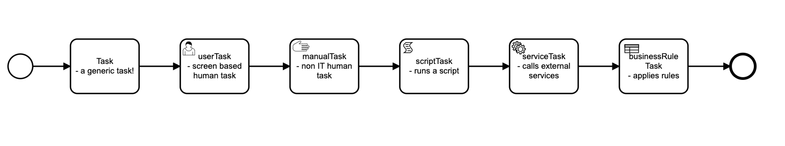
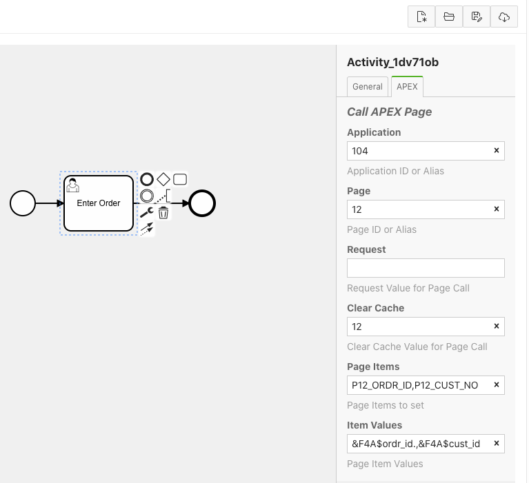
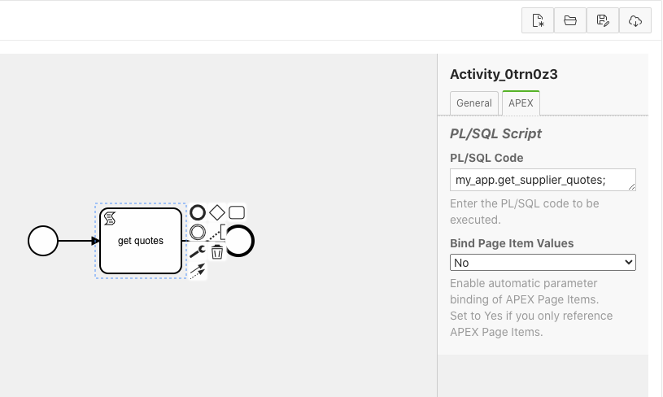

### Using Tasks to Implement Your Process

In your BPMN process, it is the Task objects that actually do the work!  Starting with Flows for APEX V5.0, tasks can be modelled with specialty task objects that call  APEX pages, run scripts, and send messages.  This section describes those tasks and how to use and configure them.



#### Supported Task Types

###### 1. bpmn:task - Task

This is the standard bpmn task.  It has no special behaviour when a process is executed.

###### 2. bpmn:userTask - Calls an APEX Page

userTask objects can be used to call an APEX page.  usertasks are configured in the APEX tab of the Flows for APEX modeler properties panel with the information required to call an APEX page.  This configuration will be familiar to anyone who has configured APEX menus.



Page Items contains a comma-separated list of items to be set in the calling page.

Item Values contains a comma-separated list of values to be supplied.  The following items are available to be substituted into the Item Values string at runtime:

- Flows for APEX Process Variables.  
  These are specified using the syntax `&F4A$<variable_name>.`  
  &F4A$ is required to be upper case.
  Note the trailing period '.'.
- Flows for APEX Pseudo Variables.  
  The current Process ID and Subflow ID are also available as pseudo variables.  
  These are specified as `&F4A$PROCESS_ID.` and `&F4A$SUBFLOW_ID.` respectively.

Note that you will need to pass the Process_ID and Subflow_ID to a page if you want the page to initiate a flow_step_complete when it is processed.

###### 3. bpmn:scriptTask - Runs a PL/SQL script

scriptTask runs a user supplied PL/SQL function.  Good practice would be to have this call an existing procedure or package, which implements your application logic.



Process variables and pseudo variables are available inside your PL/SQL procedure as follows:

- Flows for APEX Process Variables.  
  Process variables can be retrieved and used inside your procedure, using the flow_process_vars setters and getters.
- Flows for APEX Pseudo Variables.  
  Process ID and Subflow ID are available inside your procedure using following function calls  

  ```sql
  flow_plsql_runner_pkg.get_current_prcs_id
  flow_plsql_runner_pkg.get_current_sbfl_id
  ```

For example, where we have a process variable ordr_id that is used to link our business process to its subject order, we can retrieve the order ID inside our procedure using the following code snippet:

```sql
l_process_id := flow_plsql_runner_pkg.get_current_prcs_id;
l_order_id   := flow_process_vars.get_var_vc2(pi_prcs_id => l_process_id, pi_var_name => 'ordr_id');
```

APEX Page Item values are available to your procedure if you opt to bind them into your process in the modeler.  By default, they are not available.

Note that, depending upon your process, a scriptTask might not be executed from the context of an APEX page, and so APEX items might not be available.  This would occur if a script is run later, after another user has performed part of the process, or if a task operates as a result of, for example, a timer firing.  If this is the case, you should use Flows for APEX process variables to provide a variable system that is perisant for the life of your business process, rather than APEX page variables which only persist during a user session.

###### 4. bpmn:serviceTask - for sending email

Currently serviceTask is used to send email using the same mechanism as scriptTask.  You should supply a PL/SQL procedure call that sets up and calls the APEX Mail Templates features of APEX.

###### 5. bpmn:manualTasks - for non-IT tasks

manualTasks do not currently have any special functionality and currently behave like a standard bpmn:task objects.
